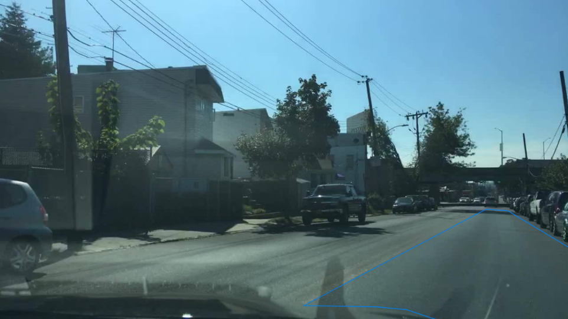
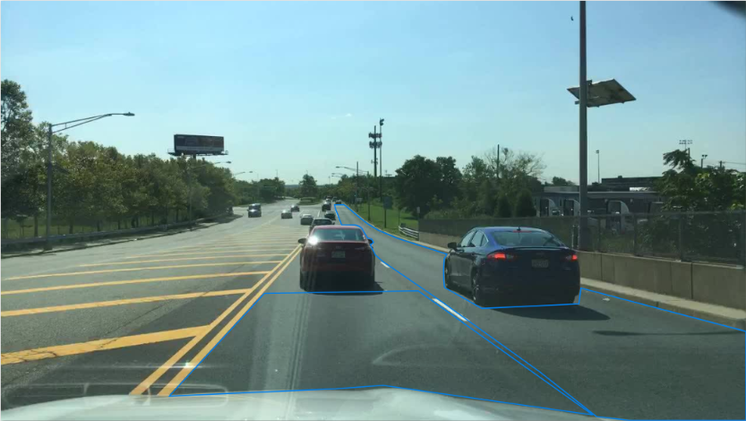
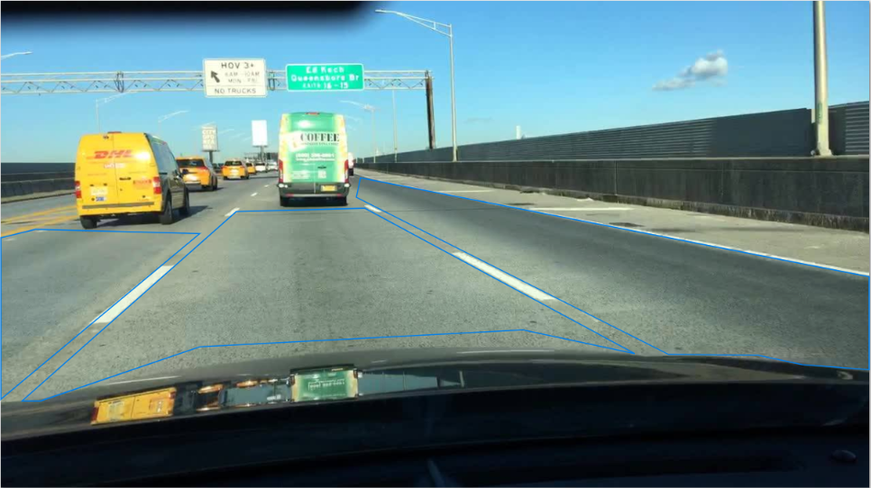
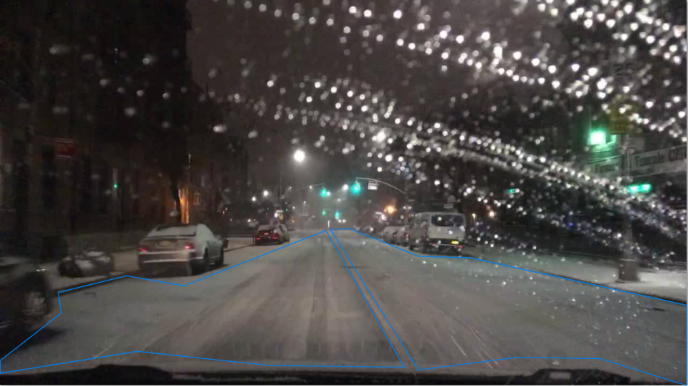
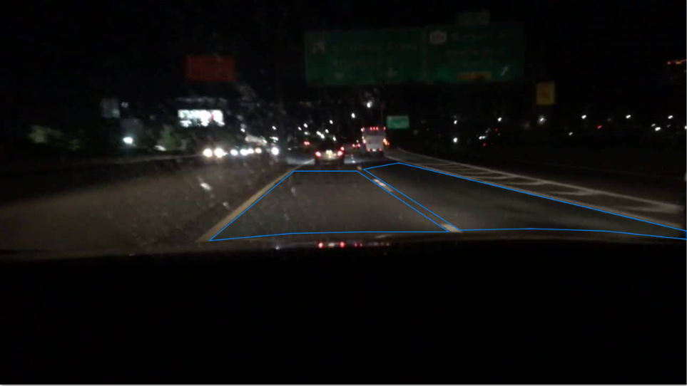
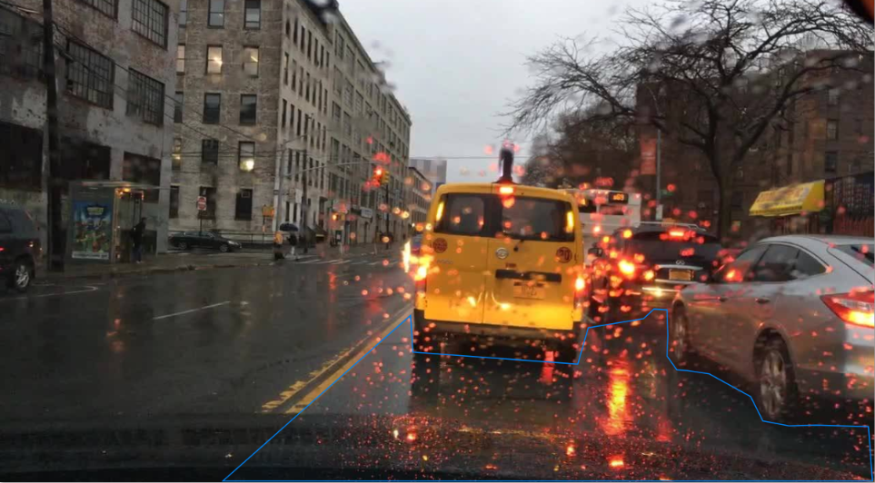
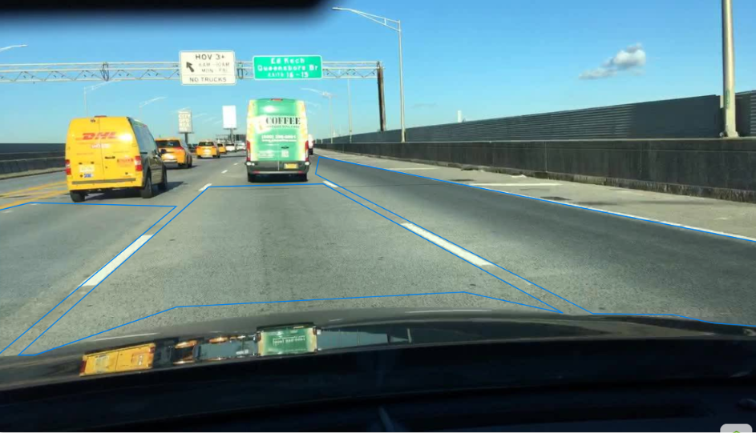
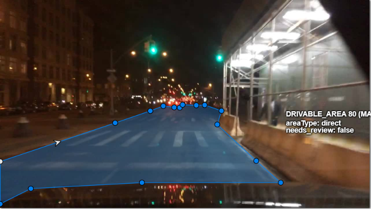
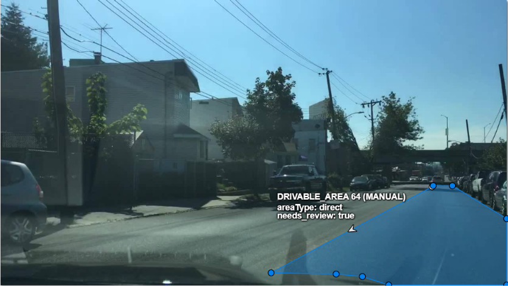

# Thư viện Edge Cases — Drivable Area Segmentation

Tài liệu này tổng hợp các tình huống biên (Edge Cases) chi tiết cho bài toán **Drivable Area Segmentation** (Polygon + `areaType`)

---

## Danh mục phân loại rủi ro Downstream Contract

Theo hợp đồng downstream (`01_problem_statement.md`):
- **False Positive (Tối kỵ - Severity: `critical`):** Gán vùng không được phép chạy (vỉa hè, thảm cỏ, bãi đỗ xe có vạch, lề tuyết trơn trượt, vùng vạch xương cá gore area) thành `drivable_area`. Lỗi này khiến xe tự hành (L2) lập quỹ đạo đâm vào chướng ngại vật hoặc leo lên vỉa hè gây tai nạn nguy hiểm.
- **False Negative (Severity: `major`):** Bỏ sót vùng đường xe chạy được hợp pháp khiến xe rụt rè, phanh gấp hoặc không thể chuyển làn.
- **Escalation Path:** Khi gặp tình huống không thể xác định ranh giới do hỏng dữ liệu quan sát (> 60% lóa sáng/mất đèn) $\rightarrow$ Không vẽ polygon, gán tag toàn ảnh **`image_escalate`**. Khi ranh giới mờ nhưng vẫn ước lượng được $\rightarrow$ Vẽ polygon kèm thuộc tính **`needs_review = true`**.
- **Geometry Tolerance:** Sai lệch đỉnh $\le 3\text{ px}$ (tối đa $\le 5\text{ px}$ theo contract), bám sát biên nhìn thấy, tuyệt đối không ngoại suy (không extrapolate xuyên qua xe tải chắn trước mặt).

---

## Chi tiết các Edge Cases

### CASE ID: EC01 — Ranh giới vỉa hè và bãi đỗ xe dọc trong phố dân cư
- **Bối cảnh (Scene):** Residential street, ban ngày, trời nhiều mây (`overcast`), đường hai chiều hẹp không vạch tim đường, có xe đỗ rải rác bên lề.
- **Hiện tượng (Observation):** Mặt đường nhựa tiếp giáp trực tiếp với gờ bó vỉa (curb) thấp và lề đất/cỏ. Không có vạch sơn phân chia mép đường hay tim đường. Một số vị trí vỉa hè bị lá rụng che phủ làm mờ ranh giới chân vỉa hè.
- **Quyết định (Decision):** **LABEL** (nửa phải) + **IGNORE** (nửa trái & vỉa hè)
- **Kỳ vọng CVAT (Expected):**
  - Vẽ 01 Polygon `drivable_area` với `areaType = direct` cho nửa mặt đường bên phải (hướng lưu thông của ego-vehicle).
  - Biên ngoài bám sát chân gờ bó vỉa hè nhìn thấy (dung sai $\le 3\text{ px}$).
  - IGNORE (không vẽ) nửa mặt đường bên trái (làn ngược chiều) và toàn bộ vỉa hè/thảm cỏ.
  - Bắt buộc đánh dấu `needs_review = true`.
- **Lý do (Rationale):** Ngăn chặn lỗi **False Positive** nghiêm trọng nhất: nếu gán vỉa hè thành drivable, mô hình sẽ học rằng "xe có thể leo lên vỉa hè" dẫn đến tai nạn va chạm người đi bộ (`critical`).
- **Lỗi thường gặp (Common mistake):** Vẽ polygon trùm lên cả vỉa hè do mặt vỉa hè thấp ngang bằng mặt đường hoặc vẽ trùm sang cả làn ngược chiều bên trái.
- **Nhóm đa dạng (Diversity):** `critical`, `ambiguity`, `residential`

**Hình ảnh minh họa:**

---

### CASE ID: EC02 — Vùng vạch xương cá (Gore Area) tại nhánh tách/nhập làn cao tốc
- **Bối cảnh (Scene):** Highway exit/merge, ban ngày, trời nắng có mây rải rác (`partly cloudy`).
- **Hiện tượng (Observation):** Tại vị trí nhánh rẽ tách khỏi cao tốc có vùng kẻ vạch chéo chữ V (vạch xương cá / gore area / chevron markings) nằm giữa làn đi thẳng và làn rẽ.
- **Quyết định (Decision):** **IGNORE** (vùng vạch xương cá) & **LABEL** (các làn lưu thông)
- **Kỳ vọng CVAT (Expected):**
  - Vẽ polygon `drivable_area` cho làn đi thẳng (`areaType = direct`) và làn nhánh rẽ (`areaType = alternative`).
  - Tuyệt đối **IGNORE (không vẽ)** polygon trùm lên vùng vạch xương cá gore area.
  - Đường biên của các polygon ôm sát mép ngoài của đường kẻ viền bao quanh gore area.
- **Lý do (Rationale):** Vùng vạch xương cá là vùng đệm phân lưu cấm phương tiện đè qua. Gán nhầm vùng này thành drivable (False Positive) sẽ khiến xe tự hành lập quỹ đạo cắt ngang qua mũi nhọn phân làn, đâm vào trụ giảm chấn hoặc hộ lan cứng ở đầu nhánh tách (`critical`).
- **Lỗi thường gặp (Common mistake):** Vẽ gộp toàn bộ mặt đường cao tốc và làn rẽ thành một polygon lớn duy nhất phủ qua cả vạch xương cá.
- **Nhóm đa dạng (Diversity):** `critical`, `conflict`, `highway`

🖼️ **Hình ảnh minh họa:**

---

### CASE ID: EC03 — Lề đường dừng khẩn cấp (Highway Shoulder) trên cao tốc
- **Bối cảnh (Scene):** Highway, ban ngày, trời nắng rải rác (`partly cloudy`), đường cao tốc nhiều làn xe chạy tốc độ cao.
- **Hiện tượng (Observation):** Làn dừng khẩn cấp (hard shoulder) nằm ngoài cùng bên phải, ngăn cách với làn xe chạy chính bằng một đường vạch sơn trắng liền nét (solid edge line). Mặt đường shoulder trải nhựa cùng loại với làn chính.
- **Quyết định (Decision):** **IGNORE** (đối với shoulder) & **LABEL** (đối với làn lưu thông)
- **Kỳ vọng CVAT (Expected):**
  - Polygon `drivable_area` của làn ngoài cùng bên phải dừng lại chính xác tại mép trong của vạch sơn trắng liền nét.
  - Tuyệt đối **IGNORE (không vẽ)** polygon lên làn dừng khẩn cấp (shoulder).
- **Lý do (Rationale):** Làn dừng khẩn cấp chỉ dành riêng cho xe cứu hộ hoặc xe hỏng đỗ tạm. Nếu gán shoulder làm drivable area (`alternative`), xe sẽ nhận diện đây là làn vượt hợp pháp, tiềm ẩn nguy cơ đâm vào phương tiện đang dừng khẩn cấp với chênh lệch tốc độ rất lớn (`critical`).
- **Lỗi thường gặp (Common mistake):** Thấy mặt đường nhựa liên tục nên tiện tay vẽ polygon tràn ra tận dải phân cách hộ lan kim loại bên phải.
- **Nhóm đa dạng (Diversity):** `critical`, `conflict`, `highway`

🖼️ **Hình ảnh minh họa:** 

---

### CASE ID: EC04 — Mặt đường bị tuyết phủ che lấp vạch kẻ, chỉ còn vệt bánh xe
- **Bối cảnh (Scene):** Residential street, ban ngày, trời có tuyết rơi (`snowy`), tuyết phủ kín mặt đường và vỉa hè.
- **Hiện tượng (Observation):** Mặt đường bị lớp tuyết dày che khuất hoàn toàn vạch sơn phân làn và mép đường, nhưng trên bề mặt xuất hiện các vệt lún bánh xe (wheel tracks/ruts) lộ rõ lớp nhựa đen hoặc tuyết nén tạo thành rãnh xe chạy. Hai bên lề có ụ tuyết đùn cao do máy dọn tuyết vun lại.
- **Quyết định (Decision):** **LABEL** + **REVIEW**
- **Kỳ vọng CVAT (Expected):**
  - Tạo polygon `drivable_area` với `areaType = direct` lấy trục đối xứng là vệt bánh xe của ego-vehicle đang lưu thông.
  - Biên ngoài của polygon mở rộng từ vệt bánh xe ra mỗi bên khoảng 0.5m – 0.8m, dừng tại chân mép ụ tuyết đùn cao bên lề (snow bank).
  - Bắt buộc đánh dấu `needs_review = true`.
- **Lý do (Rationale):** Trong điều kiện mất vạch kẻ do tuyết, quỹ đạo an toàn duy nhất mà xe có thể bám theo là vệt bánh xe đã được nén an toàn trước đó. Biên không được mở rộng vào ụ tuyết đùn để tránh sa lầy hoặc mất lái.
- **Lỗi thường gặp (Common mistake):** Bỏ qua không vẽ vì không thấy vạch sơn (False Negative nặng), hoặc vẽ polygon phẳng trùm lên cả ụ tuyết đùn hai bên lề (False Positive).
- **Nhóm đa dạng (Diversity):** `ambiguity`, `low_visibility`, `critical`

🖼️ **Hình ảnh minh họa:** 

---

### CASE ID: EC05 — Đường ban đêm thiếu vạch kẻ và giới hạn chùm sáng đèn pha
- **Bối cảnh (Scene):** City street, ban đêm (`night`), trời quang (`clear`), đèn đường yếu hoặc không đồng đều.
- **Hiện tượng (Observation):** Mặt đường bê tông/nhựa tối màu, vạch kẻ sơn phân làn bị mòn mờ hoặc đứt quãng. Tầm nhìn xa bị giới hạn nghiêm trọng bởi quầng chiếu sáng của đèn pha xe; phía ngoài chùm sáng là vùng đen đặc không rõ chi tiết.
- **Quyết định (Decision):** **LABEL** + **REVIEW**
- **Kỳ vọng CVAT (Expected):**
  - Vẽ polygon `drivable_area` (`direct` cho làn trước mặt, `alternative` cho làn bên cạnh nếu nhìn rõ vạch phân cách mờ).
  - **Quy tắc cắt biên hình học:** Polygon dừng lại dứt khoát tại đường ranh giới phân cắt giữa vùng được đèn pha chiếu sáng và vùng tối đen mù mịt (cut-off boundary). Tuyệt đối không vẽ kéo dài vào khoảng tối mù.
  - Dung sai biên ngang $\le 3\text{ px}$, đánh dấu `needs_review = true`.
- **Lý do (Rationale):** Tuân thủ downstream contract: "Ranh giới đi theo phần nhìn thấy được, không suy đoán phía sau". Cảm biến quang học của xe không được huấn luyện trên dữ liệu suy đoán vào bóng đêm vô căn cứ.
- **Lỗi thường gặp (Common mistake):** Phóng tầm mắt ước lượng điểm tụ chân trời rồi vẽ polygon kéo dài thẳng vào khoảng đen đặc.
- **Nhóm đa dạng (Diversity):** `low_visibility`, `ambiguity`, `night`

🖼️ **Hình ảnh minh họa:**

---

### CASE ID: EC06 — Mặt đường ướt phản chiếu ánh đèn gây nhiễu vạch ảo & gạt nước che
- **Bối cảnh (Scene):** City street, ban ngày, trời mưa to (`rainy`), mặt đường đọng nước và có cần gạt nước hoạt động.
- **Hiện tượng (Observation):** Mặt đường ướt sũng phản chiếu bóng các tòa nhà, phương tiện và đèn tín hiệu tạo ra các vệt sáng vạch giả trên mặt đường nhựa. Góc kính chắn gió có vệt cần gạt nước tạo màng nước mờ nhòe quang học.
- **Quyết định (Decision):** **LABEL** + **REVIEW**
- **Kỳ vọng CVAT (Expected):**
  - Phân biệt vạch sơn thật (có độ dày, tính liên tục hình học theo phối cảnh) với vệt phản quang vũng nước (biến dạng theo bề mặt nước đọng).
  - Vẽ polygon `direct` bám sát mặt đường thực tế nhìn xuyên qua kính lái trong vùng quét rõ của cần gạt nước. Bỏ qua góc khuất bị cơ học cần gạt nước che.
  - Tag `image_context`: `weather = rainy`. Đánh dấu `needs_review = true` nếu phản chiếu gây khó xác định vạch phân làn.
- **Lý do (Rationale):** Ngăn ngừa việc nhận nhầm phản xạ gương mặt nước thành vạch kẻ đường, đảm bảo polygon drivable area phản ánh đúng cấu trúc bề mặt vật lý của lòng đường.
- **Lỗi thường gặp (Common mistake):** Vẽ đường biên polygon uốn lượn lách theo các vệt bóng phản chiếu trên mặt đường ướt.
- **Nhóm đa dạng (Diversity):** `low_visibility`, `occlusion`, `rainy`

🖼️ **Hình ảnh minh họa:**

---

### CASE ID: EC07 — Xe lớn che khuất tầm nhìn mặt đường phía trước (Cấm ngoại suy)
- **Bối cảnh (Scene):** Highway, ban ngày, trời nhiều mây (`overcast`), mật độ giao thông đông đúc.
- **Hiện tượng (Observation):** Một chiếc xe cỡ lớn đang chạy ngay phía trước xe ego ở khoảng cách gần, che khuất gần như toàn bộ phần mặt đường phía trước nó và che khuất cả vạch kẻ phân làn ở phía xa.
- **Quyết định (Decision):** **LABEL** (Non-amodal segmentation)
- **Kỳ vọng CVAT (Expected):**
  - Polygon `direct` xuất phát từ nắp capo xe ego kéo dài đến chân tiếp đất của bánh sau chiếc xe tải lớn.
  - **Quy tắc cấm ngoại suy (No extrapolation):** Tuyệt đối KHÔNG vẽ polygon luồn qua gầm xe tải hoặc vẽ suy đoán phần mặt đường phía trước xe tải. Ranh giới phía trước của polygon bám sát đường viền tiếp giáp của bánh xe và bóng gầm xe tải với mặt đường.
  - Làn bên cạnh nếu không bị che thì vẫn vẽ kéo dài bình thường.
- **Lý do (Rationale):** Tuân thủ downstream contract: "Vật thể che mặt đường $\rightarrow$ ranh giới đi theo phần nhìn thấy được, không suy đoán phía sau". Xe tự hành không thể chạy xuyên qua xe tải, việc suy đoán mặt đường sau vật cản lớn gây nguy hiểm tiềm tàng cho bộ lập quỹ đạo tức thời.
- **Lỗi thường gặp (Common mistake):** Vẽ polygon xuyên qua gầm và thân xe tải như thể chiếc xe tải trong suốt (amodal prediction).
- **Nhóm đa dạng (Diversity):** `occlusion`, `conflict`

🖼️ **Hình ảnh minh họa:**

---

### CASE ID: EC08 — Vạch kẻ sang đường cho người đi bộ (Crosswalk) cắt ngang làn
- **Bối cảnh (Scene):** City street, ban đêm (`night`), trời quang, khu vực giao lộ có vạch kẻ sang đường cho người đi bộ (Crosswalk).
- **Hiện tượng (Observation):** Vạch sơn người đi bộ màu trắng nổi bật dạng sọc ngựa vằn cắt ngang trực diện toàn bộ chiều rộng lòng đường ngay trước đầu xe ego.
- **Quyết định (Decision):** **LABEL**
- **Kỳ vọng CVAT (Expected):**
  - Polygon `drivable_area` (`direct`) được vẽ **bao trùm liên tục xuyên qua vạch crosswalk**.
  - Không được cắt rời hay ngắt quãng polygon trước và sau vạch kẻ đi bộ.
  - Ranh giới hai bên dừng tại chân mép vỉa hè (curb), không vẽ tràn lên lối đi bộ trên vỉa hè.
- **Lý do (Rationale):** Vạch đi bộ qua đường cắt ngang mặt đường xe chạy vẫn là bề mặt giao thông hợp lệ mà ô tô được phép di chuyển đè lên để đi qua giao lộ. Cắt đứt polygon sẽ khiến hệ thống tự hành hiểu nhầm là đường cụt (dead end) và kích hoạt phanh khẩn cấp sai lầm.
- **Lỗi thường gặp (Common mistake):** Cắt cụt polygon dừng trước vạch crosswalk hoặc khoét lỗ quanh từng vạch sơn trắng của crosswalk.
- **Nhóm đa dạng (Diversity):** `critical`, `conflict`, `city_street`

🖼️ **Hình ảnh minh họa:**

---

### CASE ID: EC09 — Hàng xe ô tô đỗ song song sát lề đường trong phố đô thị
- **Bối cảnh (Scene):** City street, ban ngày, trời nắng rải rác (`partly cloudy`), khu vực phố thương mại có hàng xe ô tô đỗ song song sát vỉa hè bên phải.
- **Hiện tượng (Observation):** Hàng xe ô tô đỗ liên tục dọc theo mép lề đường bên phải. Không có vạch kẻ ô đỗ xe riêng biệt mà đỗ trực tiếp trên mặt đường nhựa chung.
- **Quyết định (Decision):** **LABEL** + **IGNORE**
- **Kỳ vọng CVAT (Expected):**
  - Vẽ polygon `drivable_area` (`direct`) cho làn xe đang di chuyển thông suốt.
  - Ranh giới mép phải của polygon vẽ men sát theo mép ngoài thân của hàng xe đang đỗ (cho phép biên cách thân xe đỗ khoảng 0.2m – 0.5m tạo khoảng an toàn).
  - Tuyệt đối **IGNORE (không vẽ)** polygon luồn vào khoảng hở giữa các xe đỗ hoặc vẽ vào phần gầm/sau đuôi xe đỗ.
- **Lý do (Rationale):** Hàng xe đỗ đã chiếm dụng vật lý mặt đường biến nó thành chướng ngại vật cố định không còn khả năng lưu thông. Phân định rõ ràng giữa "mặt đường lý thuyết" và "mặt đường chức năng có thể chạy được tức thời" cho ego-planning.
- **Lỗi thường gặp (Common mistake):** Thấy mặt đường chung nên tiện tay vẽ polygon đè trùm lên cả hàng xe đang đỗ hoặc vẽ lượn zíc-zắc vào khe hẹp giữa hai xe đỗ.
- **Nhóm đa dạng (Diversity):** `occlusion`, `conflict`, `city_street`

🖼️ **Hình ảnh minh họa:**

# Thư viện Edge Cases — Drivable Area Segmentation

Tài liệu này tổng hợp các tình huống biên (Edge Cases) chi tiết cho bài toán **Drivable Area Segmentation** (Polygon + `areaType`)

---

## Danh mục phân loại rủi ro Downstream Contract

Theo hợp đồng downstream (`01_problem_statement.md`):
- **False Positive (Tối kỵ - Severity: `critical`):** Gán vùng không được phép chạy (vỉa hè, thảm cỏ, bãi đỗ xe có vạch, lề tuyết trơn trượt, vùng vạch xương cá gore area) thành `drivable_area`. Lỗi này khiến xe tự hành (L2) lập quỹ đạo đâm vào chướng ngại vật hoặc leo lên vỉa hè gây tai nạn nguy hiểm.
- **False Negative (Severity: `major`):** Bỏ sót vùng đường xe chạy được hợp pháp khiến xe rụt rè, phanh gấp hoặc không thể chuyển làn.
- **Escalation Path:** Khi gặp tình huống không thể xác định ranh giới do hỏng dữ liệu quan sát (> 60% lóa sáng/mất đèn) $\rightarrow$ Không vẽ polygon, gán tag toàn ảnh **`image_escalate`**. Khi ranh giới mờ nhưng vẫn ước lượng được $\rightarrow$ Vẽ polygon kèm thuộc tính **`needs_review = true`**.
- **Geometry Tolerance:** Sai lệch đỉnh $\le 3\text{ px}$ (tối đa $\le 5\text{ px}$ theo contract), bám sát biên nhìn thấy, tuyệt đối không ngoại suy (không extrapolate xuyên qua xe tải chắn trước mặt).

---

## Chi tiết các Edge Cases

### CASE ID: EC01 — Ranh giới vỉa hè và bãi đỗ xe dọc trong phố dân cư
- **Bối cảnh (Scene):** Residential street, ban ngày, trời nhiều mây (`overcast`), đường hai chiều hẹp không vạch tim đường, có xe đỗ rải rác bên lề.
- **Hiện tượng (Observation):** Mặt đường nhựa tiếp giáp trực tiếp với gờ bó vỉa (curb) thấp và lề đất/cỏ. Không có vạch sơn phân chia mép đường hay tim đường. Một số vị trí vỉa hè bị lá rụng che phủ làm mờ ranh giới chân vỉa hè.
- **Quyết định (Decision):** **LABEL** (nửa phải) + **IGNORE** (nửa trái & vỉa hè)
- **Kỳ vọng CVAT (Expected):**
  - Vẽ 01 Polygon `drivable_area` với `areaType = direct` cho nửa mặt đường bên phải (hướng lưu thông của ego-vehicle).
  - Biên ngoài bám sát chân gờ bó vỉa hè nhìn thấy (dung sai $\le 3\text{ px}$).
  - IGNORE (không vẽ) nửa mặt đường bên trái (làn ngược chiều) và toàn bộ vỉa hè/thảm cỏ.
  - Bắt buộc đánh dấu `needs_review = true`.
- **Lý do (Rationale):** Ngăn chặn lỗi **False Positive** nghiêm trọng nhất: nếu gán vỉa hè thành drivable, mô hình sẽ học rằng "xe có thể leo lên vỉa hè" dẫn đến tai nạn va chạm người đi bộ (`critical`).
- **Lỗi thường gặp (Common mistake):** Vẽ polygon trùm lên cả vỉa hè do mặt vỉa hè thấp ngang bằng mặt đường hoặc vẽ trùm sang cả làn ngược chiều bên trái.
- **Nhóm đa dạng (Diversity):** `critical`, `ambiguity`, `residential`

**Hình ảnh minh họa:**

---

### CASE ID: EC02 — Vùng vạch xương cá (Gore Area) tại nhánh tách/nhập làn cao tốc
- **Bối cảnh (Scene):** Highway exit/merge, ban ngày, trời nắng có mây rải rác (`partly cloudy`).
- **Hiện tượng (Observation):** Tại vị trí nhánh rẽ tách khỏi cao tốc có vùng kẻ vạch chéo chữ V (vạch xương cá / gore area / chevron markings) nằm giữa làn đi thẳng và làn rẽ.
- **Quyết định (Decision):** **IGNORE** (vùng vạch xương cá) & **LABEL** (các làn lưu thông)
- **Kỳ vọng CVAT (Expected):**
  - Vẽ polygon `drivable_area` cho làn đi thẳng (`areaType = direct`) và làn nhánh rẽ (`areaType = alternative`).
  - Tuyệt đối **IGNORE (không vẽ)** polygon trùm lên vùng vạch xương cá gore area.
  - Đường biên của các polygon ôm sát mép ngoài của đường kẻ viền bao quanh gore area.
- **Lý do (Rationale):** Vùng vạch xương cá là vùng đệm phân lưu cấm phương tiện đè qua. Gán nhầm vùng này thành drivable (False Positive) sẽ khiến xe tự hành lập quỹ đạo cắt ngang qua mũi nhọn phân làn, đâm vào trụ giảm chấn hoặc hộ lan cứng ở đầu nhánh tách (`critical`).
- **Lỗi thường gặp (Common mistake):** Vẽ gộp toàn bộ mặt đường cao tốc và làn rẽ thành một polygon lớn duy nhất phủ qua cả vạch xương cá.
- **Nhóm đa dạng (Diversity):** `critical`, `conflict`, `highway`

🖼️ **Hình ảnh minh họa:**

---

### CASE ID: EC03 — Lề đường dừng khẩn cấp (Highway Shoulder) trên cao tốc
- **Bối cảnh (Scene):** Highway, ban ngày, trời nắng rải rác (`partly cloudy`), đường cao tốc nhiều làn xe chạy tốc độ cao.
- **Hiện tượng (Observation):** Làn dừng khẩn cấp (hard shoulder) nằm ngoài cùng bên phải, ngăn cách với làn xe chạy chính bằng một đường vạch sơn trắng liền nét (solid edge line). Mặt đường shoulder trải nhựa cùng loại với làn chính.
- **Quyết định (Decision):** **IGNORE** (đối với shoulder) & **LABEL** (đối với làn lưu thông)
- **Kỳ vọng CVAT (Expected):**
  - Polygon `drivable_area` của làn ngoài cùng bên phải dừng lại chính xác tại mép trong của vạch sơn trắng liền nét.
  - Tuyệt đối **IGNORE (không vẽ)** polygon lên làn dừng khẩn cấp (shoulder).
- **Lý do (Rationale):** Làn dừng khẩn cấp chỉ dành riêng cho xe cứu hộ hoặc xe hỏng đỗ tạm. Nếu gán shoulder làm drivable area (`alternative`), xe sẽ nhận diện đây là làn vượt hợp pháp, tiềm ẩn nguy cơ đâm vào phương tiện đang dừng khẩn cấp với chênh lệch tốc độ rất lớn (`critical`).
- **Lỗi thường gặp (Common mistake):** Thấy mặt đường nhựa liên tục nên tiện tay vẽ polygon tràn ra tận dải phân cách hộ lan kim loại bên phải.
- **Nhóm đa dạng (Diversity):** `critical`, `conflict`, `highway`

🖼️ **Hình ảnh minh họa:** 

---

### CASE ID: EC04 — Mặt đường bị tuyết phủ che lấp vạch kẻ, chỉ còn vệt bánh xe
- **Bối cảnh (Scene):** Residential street, ban ngày, trời có tuyết rơi (`snowy`), tuyết phủ kín mặt đường và vỉa hè.
- **Hiện tượng (Observation):** Mặt đường bị lớp tuyết dày che khuất hoàn toàn vạch sơn phân làn và mép đường, nhưng trên bề mặt xuất hiện các vệt lún bánh xe (wheel tracks/ruts) lộ rõ lớp nhựa đen hoặc tuyết nén tạo thành rãnh xe chạy. Hai bên lề có ụ tuyết đùn cao do máy dọn tuyết vun lại.
- **Quyết định (Decision):** **LABEL** + **REVIEW**
- **Kỳ vọng CVAT (Expected):**
  - Tạo polygon `drivable_area` với `areaType = direct` lấy trục đối xứng là vệt bánh xe của ego-vehicle đang lưu thông.
  - Biên ngoài của polygon mở rộng từ vệt bánh xe ra mỗi bên khoảng 0.5m – 0.8m, dừng tại chân mép ụ tuyết đùn cao bên lề (snow bank).
  - Bắt buộc đánh dấu `needs_review = true`.
- **Lý do (Rationale):** Trong điều kiện mất vạch kẻ do tuyết, quỹ đạo an toàn duy nhất mà xe có thể bám theo là vệt bánh xe đã được nén an toàn trước đó. Biên không được mở rộng vào ụ tuyết đùn để tránh sa lầy hoặc mất lái.
- **Lỗi thường gặp (Common mistake):** Bỏ qua không vẽ vì không thấy vạch sơn (False Negative nặng), hoặc vẽ polygon phẳng trùm lên cả ụ tuyết đùn hai bên lề (False Positive).
- **Nhóm đa dạng (Diversity):** `ambiguity`, `low_visibility`, `critical`

🖼️ **Hình ảnh minh họa:** 

---

### CASE ID: EC05 — Đường ban đêm thiếu vạch kẻ và giới hạn chùm sáng đèn pha
- **Bối cảnh (Scene):** City street, ban đêm (`night`), trời quang (`clear`), đèn đường yếu hoặc không đồng đều.
- **Hiện tượng (Observation):** Mặt đường bê tông/nhựa tối màu, vạch kẻ sơn phân làn bị mòn mờ hoặc đứt quãng. Tầm nhìn xa bị giới hạn nghiêm trọng bởi quầng chiếu sáng của đèn pha xe; phía ngoài chùm sáng là vùng đen đặc không rõ chi tiết.
- **Quyết định (Decision):** **LABEL** + **REVIEW**
- **Kỳ vọng CVAT (Expected):**
  - Vẽ polygon `drivable_area` (`direct` cho làn trước mặt, `alternative` cho làn bên cạnh nếu nhìn rõ vạch phân cách mờ).
  - **Quy tắc cắt biên hình học:** Polygon dừng lại dứt khoát tại đường ranh giới phân cắt giữa vùng được đèn pha chiếu sáng và vùng tối đen mù mịt (cut-off boundary). Tuyệt đối không vẽ kéo dài vào khoảng tối mù.
  - Dung sai biên ngang $\le 3\text{ px}$, đánh dấu `needs_review = true`.
- **Lý do (Rationale):** Tuân thủ downstream contract: "Ranh giới đi theo phần nhìn thấy được, không suy đoán phía sau". Cảm biến quang học của xe không được huấn luyện trên dữ liệu suy đoán vào bóng đêm vô căn cứ.
- **Lỗi thường gặp (Common mistake):** Phóng tầm mắt ước lượng điểm tụ chân trời rồi vẽ polygon kéo dài thẳng vào khoảng đen đặc.
- **Nhóm đa dạng (Diversity):** `low_visibility`, `ambiguity`, `night`

🖼️ **Hình ảnh minh họa:**

---

### CASE ID: EC06 — Mặt đường ướt phản chiếu ánh đèn gây nhiễu vạch ảo & gạt nước che
- **Bối cảnh (Scene):** City street, ban ngày, trời mưa to (`rainy`), mặt đường đọng nước và có cần gạt nước hoạt động.
- **Hiện tượng (Observation):** Mặt đường ướt sũng phản chiếu bóng các tòa nhà, phương tiện và đèn tín hiệu tạo ra các vệt sáng vạch giả trên mặt đường nhựa. Góc kính chắn gió có vệt cần gạt nước tạo màng nước mờ nhòe quang học.
- **Quyết định (Decision):** **LABEL** + **REVIEW**
- **Kỳ vọng CVAT (Expected):**
  - Phân biệt vạch sơn thật (có độ dày, tính liên tục hình học theo phối cảnh) với vệt phản quang vũng nước (biến dạng theo bề mặt nước đọng).
  - Vẽ polygon `direct` bám sát mặt đường thực tế nhìn xuyên qua kính lái trong vùng quét rõ của cần gạt nước. Bỏ qua góc khuất bị cơ học cần gạt nước che.
  - Tag `image_context`: `weather = rainy`. Đánh dấu `needs_review = true` nếu phản chiếu gây khó xác định vạch phân làn.
- **Lý do (Rationale):** Ngăn ngừa việc nhận nhầm phản xạ gương mặt nước thành vạch kẻ đường, đảm bảo polygon drivable area phản ánh đúng cấu trúc bề mặt vật lý của lòng đường.
- **Lỗi thường gặp (Common mistake):** Vẽ đường biên polygon uốn lượn lách theo các vệt bóng phản chiếu trên mặt đường ướt.
- **Nhóm đa dạng (Diversity):** `low_visibility`, `occlusion`, `rainy`

🖼️ **Hình ảnh minh họa:**

---

### CASE ID: EC07 — Xe lớn che khuất tầm nhìn mặt đường phía trước (Cấm ngoại suy)
- **Bối cảnh (Scene):** Highway, ban ngày, trời nhiều mây (`overcast`), mật độ giao thông đông đúc.
- **Hiện tượng (Observation):** Một chiếc xe cỡ lớn đang chạy ngay phía trước xe ego ở khoảng cách gần, che khuất gần như toàn bộ phần mặt đường phía trước nó và che khuất cả vạch kẻ phân làn ở phía xa.
- **Quyết định (Decision):** **LABEL** (Non-amodal segmentation)
- **Kỳ vọng CVAT (Expected):**
  - Polygon `direct` xuất phát từ nắp capo xe ego kéo dài đến chân tiếp đất của bánh sau chiếc xe tải lớn.
  - **Quy tắc cấm ngoại suy (No extrapolation):** Tuyệt đối KHÔNG vẽ polygon luồn qua gầm xe tải hoặc vẽ suy đoán phần mặt đường phía trước xe tải. Ranh giới phía trước của polygon bám sát đường viền tiếp giáp của bánh xe và bóng gầm xe tải với mặt đường.
  - Làn bên cạnh nếu không bị che thì vẫn vẽ kéo dài bình thường.
- **Lý do (Rationale):** Tuân thủ downstream contract: "Vật thể che mặt đường $\rightarrow$ ranh giới đi theo phần nhìn thấy được, không suy đoán phía sau". Xe tự hành không thể chạy xuyên qua xe tải, việc suy đoán mặt đường sau vật cản lớn gây nguy hiểm tiềm tàng cho bộ lập quỹ đạo tức thời.
- **Lỗi thường gặp (Common mistake):** Vẽ polygon xuyên qua gầm và thân xe tải như thể chiếc xe tải trong suốt (amodal prediction).
- **Nhóm đa dạng (Diversity):** `occlusion`, `conflict`

🖼️ **Hình ảnh minh họa:**

---

### CASE ID: EC08 — Vạch kẻ sang đường cho người đi bộ (Crosswalk) cắt ngang làn
- **Bối cảnh (Scene):** City street, ban đêm (`night`), trời quang, khu vực giao lộ có vạch kẻ sang đường cho người đi bộ (Crosswalk).
- **Hiện tượng (Observation):** Vạch sơn người đi bộ màu trắng nổi bật dạng sọc ngựa vằn cắt ngang trực diện toàn bộ chiều rộng lòng đường ngay trước đầu xe ego.
- **Quyết định (Decision):** **LABEL**
- **Kỳ vọng CVAT (Expected):**
  - Polygon `drivable_area` (`direct`) được vẽ **bao trùm liên tục xuyên qua vạch crosswalk**.
  - Không được cắt rời hay ngắt quãng polygon trước và sau vạch kẻ đi bộ.
  - Ranh giới hai bên dừng tại chân mép vỉa hè (curb), không vẽ tràn lên lối đi bộ trên vỉa hè.
- **Lý do (Rationale):** Vạch đi bộ qua đường cắt ngang mặt đường xe chạy vẫn là bề mặt giao thông hợp lệ mà ô tô được phép di chuyển đè lên để đi qua giao lộ. Cắt đứt polygon sẽ khiến hệ thống tự hành hiểu nhầm là đường cụt (dead end) và kích hoạt phanh khẩn cấp sai lầm.
- **Lỗi thường gặp (Common mistake):** Cắt cụt polygon dừng trước vạch crosswalk hoặc khoét lỗ quanh từng vạch sơn trắng của crosswalk.
- **Nhóm đa dạng (Diversity):** `critical`, `conflict`, `city_street`

🖼️ **Hình ảnh minh họa:**

---

### CASE ID: EC09 — Hàng xe ô tô đỗ song song sát lề đường trong phố đô thị
- **Bối cảnh (Scene):** City street, ban ngày, trời nắng rải rác (`partly cloudy`), khu vực phố thương mại có hàng xe ô tô đỗ song song sát vỉa hè bên phải.
- **Hiện tượng (Observation):** Hàng xe ô tô đỗ liên tục dọc theo mép lề đường bên phải. Không có vạch kẻ ô đỗ xe riêng biệt mà đỗ trực tiếp trên mặt đường nhựa chung.
- **Quyết định (Decision):** **LABEL** + **IGNORE**
- **Kỳ vọng CVAT (Expected):**
  - Vẽ polygon `drivable_area` (`direct`) cho làn xe đang di chuyển thông suốt.
  - Ranh giới mép phải của polygon vẽ men sát theo mép ngoài thân của hàng xe đang đỗ (cho phép biên cách thân xe đỗ khoảng 0.2m – 0.5m tạo khoảng an toàn).
  - Tuyệt đối **IGNORE (không vẽ)** polygon luồn vào khoảng hở giữa các xe đỗ hoặc vẽ vào phần gầm/sau đuôi xe đỗ.
- **Lý do (Rationale):** Hàng xe đỗ đã chiếm dụng vật lý mặt đường biến nó thành chướng ngại vật cố định không còn khả năng lưu thông. Phân định rõ ràng giữa "mặt đường lý thuyết" và "mặt đường chức năng có thể chạy được tức thời" cho ego-planning.
- **Lỗi thường gặp (Common mistake):** Thấy mặt đường chung nên tiện tay vẽ polygon đè trùm lên cả hàng xe đang đỗ hoặc vẽ lượn zíc-zắc vào khe hẹp giữa hai xe đỗ.
- **Nhóm đa dạng (Diversity):** `occlusion`, `conflict`, `city_street`

🖼️ **Hình ảnh minh họa:**

